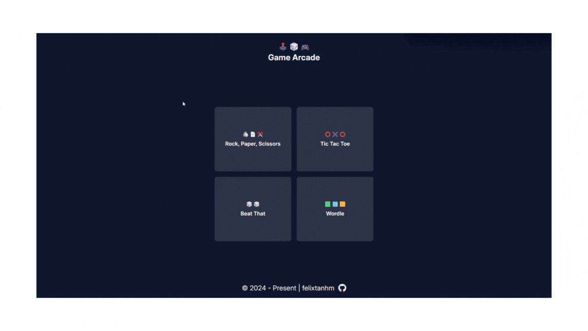

# Game Arcade 🕹️

### Reflections

In these few months, every project that I've done was with some form of guidance and structure provided by a course provider. Game Arcade was started as a means to consolidate all that I have learnt so far in my journey of learning to code.

It also serves as an experiment for me to figure out how I would like to tackle future self-initiated projects. This has been a fun project, and I hope you have a bit of fun with these simple games. 🙂

[Live Demo](https://game-arcade.pages.dev/) ✨

### Technologies

- React
- React Router
- Tailwind CSS
- Headless UI
- Vite

### Future Development

- React Testing Library
- Multi-Player Mode
- Tic Tac Toe MiniMax algorithm
